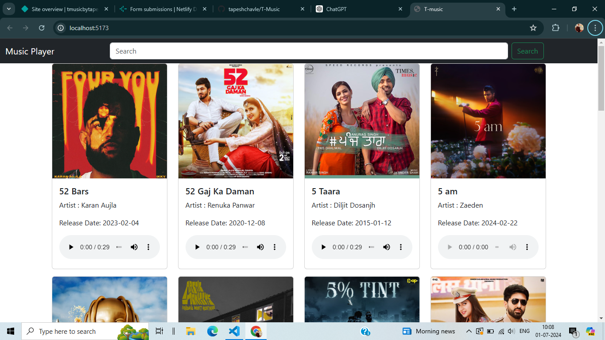
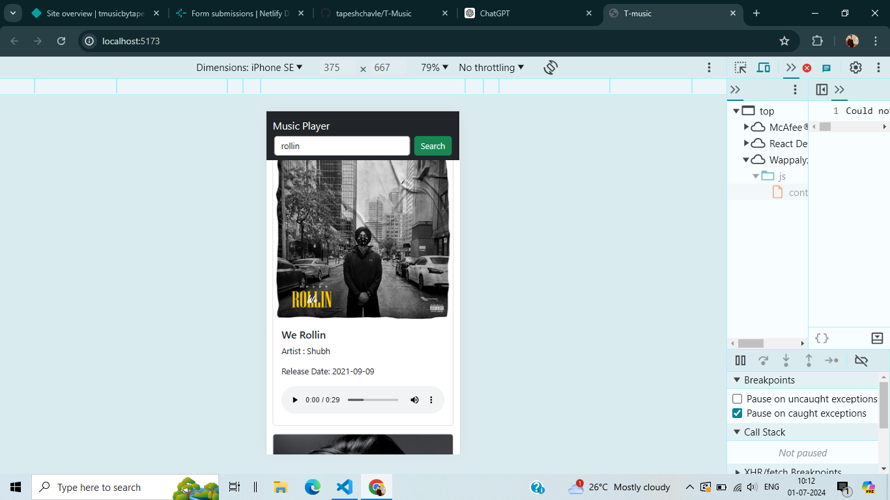

# Music App

Welcome to the Music App! This application provides a seamless music experience, combining modern web technologies to deliver a smooth and responsive interface. Built using HTML, Bootstrap, and React, our app offers a user-friendly platform for music enthusiasts.

# Features

Search Functionality: Easily search for songs, albums, and artists with a powerful search feature. 
Real-time Streaming: Enjoy high-quality music streaming with minimal buffering. 
Responsive Design: Fully responsive layout that adapts to different screen sizes and devices. 
Interactive UI: Sleek and interactive user interface designed with Bootstrap and React components. 

# User Interface

  <h3>Laptop</h3>
  </img>
  <h3>Laptop</h3>
  </img>

# Technologies Used

HTML5: Markup language used for structuring the app's content. 
Bootstrap: CSS framework used for designing a responsive and mobile-first layout. 
React: JavaScript library for building the user interface and managing application state. 

# Getting Started

To get started with the Music App, follow these steps: 

Clone the Repository: 

bash 
Copy code 
git clone https://github.com/tapeshchavle/T-music.git 
cd music-app 
Install Dependencies: 

bash 
Copy code 
npm install  
Run the Application: 

bash 
Copy code  
npm start 
The app will be available at http://localhost:3000. 

# Contributing

We welcome contributions to improve the Music App. To contribute, please follow these steps:

<pre>
Fork the repository.
Create a new branch (git checkout -b feature-branch).
Make your changes and commit them (git commit -m 'Add new feature').
Push to the branch (git push origin feature-branch).
Open a pull request.
</pre>

# Acknowledgments

Thanks to the developers and designers who contributed to the open-source libraries and frameworks used in this project.
